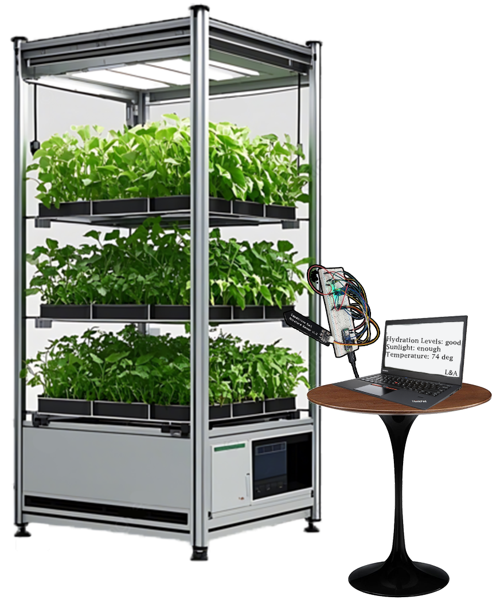

# Encouraging Gardening and Healthy Eating with E-Garden
**A Smart Gardening Assistant to Reduce Food Insecurity**
designed to empower individuals and communities with limited access to fresh produce. By combining real-time environmental sensing, intuitive feedback, and accessible technology, E-Garden simplifies plant care and promotes healthier eating through DIY gardening.


## Table of Contents
### The story of E-Garden


- [The Food Access Gap](#The-Food-Access-Gap)
- [The Goals of E-Garden](#The-Goals-of-E-Garden)
- [Prototype](#Prototype)
- [Conclusion](#Conclusion)
- [Looking Forward](#Looking-Forward)
- [Poster](#Poster)

### Product setup


- [Hardware Setup](#Hardware-Setup)
- [Software Installation](#Software-Installation)
- [Data Flow](#data-flow)
- [Getting Started](#Getting-Started)
- [Support](#Support)
- [Acknowledgements/References](#Acknowledgements/References)
- [License](#license)

## The Food Access Gap

An estimated **53.6 million** people in the U.S. reside in low-income areas that are more than 0.5 miles in urban areas and 10 miles in rural areas from the nearest supermarket ([USDA](https://www.ers.usda.gov/data-products/food-access-research-atlas/documentation)).

### Food insecurity
- Food Insecurity is defined as lacking the resources or ability to buy healthy nutritious food.
- Low income is directly correlated with a decrease in vegetable consumption.

A higher percentage of food-insecure respondents reported being too busy, finding fruits and vegetables too expensive, or disliking the taste of healthy food ([CDC](https://www.cdc.gov/pcd/issues/2016/15_0402.htm)).

## The Goals of E-Garden

In order to reduce food insecurity, we studied how to encourage gardening, and propose healthier eating through our prototype - The E-Garden. 

### Reducing Barriers to Fresh Food
- Encourages Consumption of Vegetables: Allows for users to be more familiar and invested in the growth and consumption of vegetables.
- Sustainable & Saves Time: Promotes sustainable eating. Quick tips make plant care easy, even for busy users.
- Simplifies Care: Sensors show exactly what the plants need, without the user having to check manually.
- Builds Confidence: Empowers first time growers with simple, clear guidance on how to take care of their plants.

## Prototype

E-Garden uses a set of sensors connected to an Arduino that continuously monitor plant health and send status updates to a lightweight wearable display, the **TinyWatch**.

### Components:
<div align="center">
    
    
    
    
   
    
</div>

- **Temperature Sensor** – tracks air temperature.
- **Moisture Sensor** – detects soil dryness.
- **Light Sensor** – measures sunlight exposure.
- **Arduino Nano ESP32** – collects sensor data and sends it to a computer.
- **TinyScreen Smart Watch Kit** – displays care messages in real time via Bluetooth or Wi-Fi.

### Total Cost: ~$50

## Prototype Functionality
- Garden sensors (moisture, light, and temperature) are placed near the plants.
- Each sensor collects real-time data about the local growing environment (repeats every 10 minutes).
- Sensor data is sent from the Arduino to the computer and logged to a text file.
- The latest data is sent from the computer’s text file via Bluetooth to the TinyScreen.
- TinyScreen displays simple plant status messages and care suggestions.

## Fully Integrated System & Prototype
<div align="left">
    
    
</div>


## Technical Features
- **Python & Arduino-Based**: Core functions are programmed using both Python and the Arduino language.
- **Scalable**: Can monitor one plant or multiple simultaneously.
- **Easy Setup**: Simple step-by-step instructions available on GitHub.
- **Plug-and-Play**: No batteries required, just connect and grow.

## Watch Interface
<div align="center">
  
  
</div>

## Conclusion
- **Addresses Food Deserts**: Helps individuals in underserved areas grow fresh food at home.
- **Promotes Healthy Habits**: Encourages vegetable consumption through hands-on involvement.
- **Reduces Common Barriers**: Tackles time, cost, and knowledge gaps with simple tech.
- **Empowers First-Time Growers**: Builds confidence and skills in sustainable gardening.
- **Low-Cost, Scalable Solution**: Accessible design that works for any small growing space.

## Looking forward
- **Community Integration**: May incorporate shared data hubs to support neighborhood or school-based community gardens.
- **Interchangeable System**: Could incorporate information specific to different types of plants and growing conditions.


## Poster
<div align="center">
    
</div>


# Setup Tutorial
This section covers how to build and use the product yourself.
## Hardware Setup

### Required Components:
- [Arduino Nano ESP32](https://www.amazon.com/Arduino-ABX00083-Bluetooth-MicroPython-Compatible/dp/B0C947BHK5)
- [TMP36 Analog Temperature Sensor](https://www.amazon.com/Analog-Devices-TMP36-Temperature-Sensor/dp/B00JYQAIBM)
- [Photoresistor (light sensor)](https://www.amazon.com/AllGIFT-Photosensitive-Dependent-Resistor-Durable/dp/B0CQ2C2Z7Q?gQT=1)
- [Capacitive Soil Moisture Sensor v1.2](https://www.amazon.com/Stemedu-Capacitive-Corrosion-Resistant-Electronic/dp/B0BTHL6M19)
- [Jumper wires](https://www.amazon.com/EDGELEC-Breadboard-Optional-Assorted-Multicolored/dp/B07GD1ZCHQ?gQT=1&th=1)
- [Breadboard](https://www.amazon.com/Breadboard-Solderless-Prototype-Distribution-Connecting/dp/B0D9LCDHF8)
- [TinyWatch](https://tinycircuits.com/products/tinyscreen-smart-watch-kit?srsltid=AfmBOopw1I692sRvHJSwYgLGjQ8IO8G3jSGKmU5bt_cmC8oi4IxcXQKg)

### Sensor Pin Mapping:
- Power (5V) → `VBUS`
- Light Sensor → `A0`
- Temperature Sensor → `A1`
- Moisture Sensor → `A2`
- Moisture Sensor → `D4`

## Software Installation

### Prerequisites:
- [Python 3](https://www.python.org/downloads/)
- [Arduino IDE](https://www.arduino.cc/en/software)
- Bluetooth enabled TinyScreen Smart Watch Kit

### Python Libraries:
```bash
pip install pyserial
```

Clone the repository:
```bash
git clone https://github.com/Arian-DK/e-garden.git
cd e-garden
```

## Data Flow

```plaintext
[ Sensors ] → prepares sensors | data_retriver.ino
   ↓
[ Computer ] → writes sensor data to text file | data_logger.py
   ↓
[ TinyScreen Interface ] → send interface to TinyScreen | tiny_watch_send_wire_data.ino
   ↓
[ TinyScreen Display ] → send data to TinyScreen | send_to_watch_wire.py
```
### Sensor Data Example (sensor_log.txt)
 ```plaintext
 2025-07-24 | 09:41:55 | Temp: 23.50C | Optimal temperature | Light: 596.2 | Optimal sunlight | Moisture: 1789.6 | Too wet
 ```
## Getting Started

1. **Connect Sensors** to the Arduino according to the wiring diagram.
2. **Run Code** following the order of the data flow.
4. **Pair TinyWatch** and begin receiving updates.
5. Watch your plants thrive with data-driven guidance.

## Support

If you encounter issues or have suggestions, please [open an issue](https://github.com/Arian-DK/e-garden/issues) or email me.

## Acknowledgements / References
- https://www.cdc.gov/pcd/issues/2016/15_0402.htm (2016, CDC).
- https://www.ers.usda.gov/data-products/food-access-research-atlas/documentation (2025, USDA).
- Dr. Young and Mr. Franklin for their help and guidance.

## License

This project is licensed under the MIT License. See the [LICENSE](LICENSE.txt) file for details.
